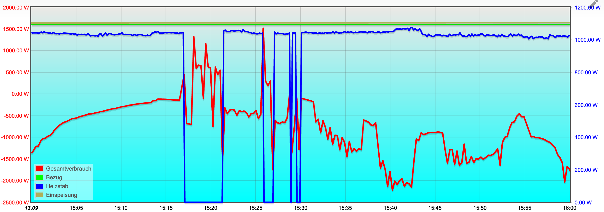

# Solarpower

Wechselrichter:  
RCT Power Storage DC 10.0

12,96 kWp auf dem Dach, 32 Module Bauer BS-M10HB 405Wp  


Pi4 mit SD.

Den Zähler auslesen, siehe:  
http://raspberry.tips/raspberrypi-tutorials/smartmeter-stromzaehler-mit-dem-raspberry-pi-auslesen-und-aufzeichnen  

Einbindung in ioBroker 
https://digitaldad.de/2022/03/13/iobroker-stromzaehler-auslesen/  

https mit letsencrypt:  
sudo certbot certonly --config-dir  /opt/iobroker/iobroker-data/letsencrypt --standalone --agree-tos --preferred-challenges http -d rxxxt.gxxx.de  

Wlan-Steckdosen (https://tasmota.github.io/docs/):  
Gosund, mit 2 USB: {"NAME":"Gosund-112v3.4","GPIO":[320,0,321,0,2656,2720,0,0,2624,257,224,0,0,4800],"FLAG":0,"BASE":18}  
Smart ohne USB: {"NAME":"Gosund SP1 v23","GPIO":[0,321,0,32,2720,2656,0,0,2624,320,224,0,0,0],"FLAG":0,"BASE":55}  

Heizstab 3kW für Speicher Solartherm 300/2 (reflex) , lediglich mit Thermostat, max. 65°:  
https://www.amazon.de/gp/product/B08TWVKVSD/ref=ppx_yo_dt_b_search_asin_title?ie=UTF8&th=1  

iobroker-Skript zum Starten des Heizstabs (ohne Leistungsregelung)  
```
var Wassertemp, HZ_Leistung, puffer, go;

Wassertemp = 50;
HZ_Leistung = 1300;
puffer = -250;
go = false;
schedule("*/5 * * * * *", async function () {
  if (getState("mqtt.0.wasser.temperatur").val > Wassertemp && getState("mqtt.0.pythonrct.power_ges").val > HZ_Leistung && go == true && compareTime('10:00', '16:00', "between", null)) {
    setState("sonoff.4.Heizstab.POWER"/*Heizstab POWER*/, true);
  } else {
    setState("sonoff.4.Heizstab.POWER"/*Heizstab POWER*/, false);
  }
});
```
Wenn mehr Ertrag > als eingestellte Leistung des Heizstabs ist, dann soll er das Wasser im Speicher heizen.
Man könnte hier noch die Leistung des Heizstabs nachregeln. mache ich erst mal nicht, denn wenn viel Sonne scheint, dann heizt meine Solarthermie das Wasser ausreichend. Ich brauche den Heizstab nur, wenn es bewölkt ist und eh nur 2-3 kW Solarertrag da sind. 

Wechselspannungsregler 220V, 10000 W:  
https://www.amazon.de/gp/product/B07SFF9VC6/ref=ppx_yo_dt_b_asin_title_o00_s00?ie=UTF8&psc=1

5V Relais Modul mit Optokoppler, um die Tasten + und - des Reglers fernbedienen zu können.

Funktioniert prächtig.  



