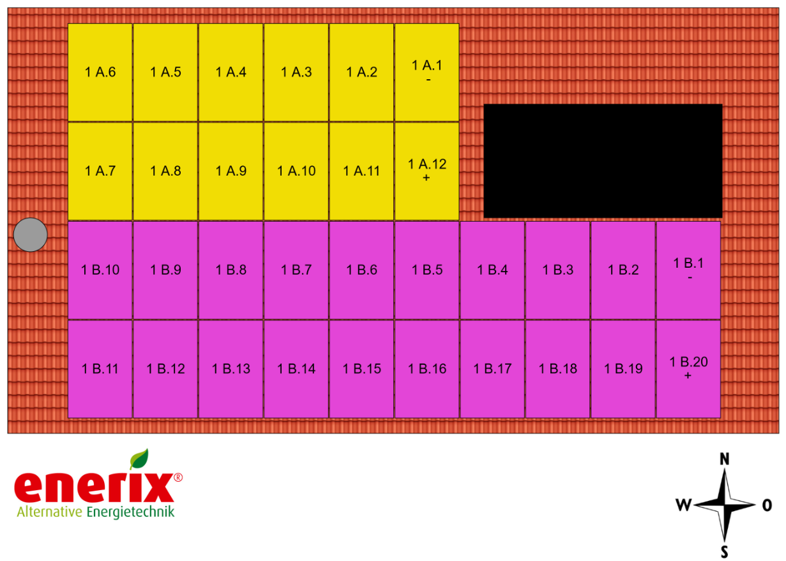

# solarpower

Wechselrichter:  
RCT Power Storage DC 10.0

12,96 kWp auf dem Dach, 32 Module Bauer BS-M10HB 405Wp  


Pi4 mit SD.

Den Zähler auslesen, siehe:  
http://raspberry.tips/raspberrypi-tutorials/smartmeter-stromzaehler-mit-dem-raspberry-pi-auslesen-und-aufzeichnen  

Einbindung in ioBroker 
https://digitaldad.de/2022/03/13/iobroker-stromzaehler-auslesen/  

Wlan-Steckdosen (https://tasmota.github.io/docs/):  
Gosund, mit 2 USB: {"NAME":"Gosund-112v3.4","GPIO":[320,0,321,0,2656,2720,0,0,2624,257,224,0,0,4800],"FLAG":0,"BASE":18}  
Smart ohne USB: {"NAME":"Gosund SP1 v23","GPIO":[0,321,0,32,2720,2656,0,0,2624,320,224,0,0,0],"FLAG":0,"BASE":55}  

Heizstab 3kW für Speicher Solartherm 300/2 (reflex) , lediglich mit Thermostat max. 65°.

Skript zum Starten des Heizstabs (ohne Leistungsregelung)  
```
var go;

go = false;
schedule("*/15 * * * * *", async function () {
  if (go == true) {
    if (getState("smartmeter.0.1-0:16_7_0__255.value").val < -3050 && getState("sonoff.4.Heizstab.POWER").val == false) {
      setState("sonoff.4.Heizstab.POWER"/*Heizstab POWER*/, true);
    } else if (getState("smartmeter.0.1-0:16_7_0__255.value").val >= -10 && getState("sonoff.4.Heizstab.POWER").val == true) {
      setState("sonoff.4.Heizstab.POWER"/*Heizstab POWER*/, false);
    }
  }
  if (go == false) {
    setState("sonoff.4.Heizstab.POWER"/*Heizstab POWER*/, false);
  }
});
```
Wechselspannungsregler 220V, 10000W:  
https://www.amazon.de/gp/product/B07SFF9VC6/ref=ppx_yo_dt_b_asin_title_o00_s00?ie=UTF8&psc=1

5V Relais Modul mit Optokoppler um die Tasten + und - des Reglers Fernbedienen zu können.

Skript liest die Größe der eingespeisten Leistung (Pe). Bei Pe < 3kW wird der Heizstab eingeschaltet.  
Eingespeiste Leisting ist nun > 0.  
Bei Pe = 0 wird der Heizstab abgeschaltet.

TBD:  
Ziel ist es, abhängig vom verfügbaren Überschuss mit dem Wechselspannungsregler die Leistung des Heizstabes bis auf ca. 300 W. zu veringern, damit der Heizstab auch an Tagen mit geringerer Ausbeute betrieben werden kann, ohne Energie aus dem öffentlichen Netz kaufen zu müssen.  

Schaumermal.


